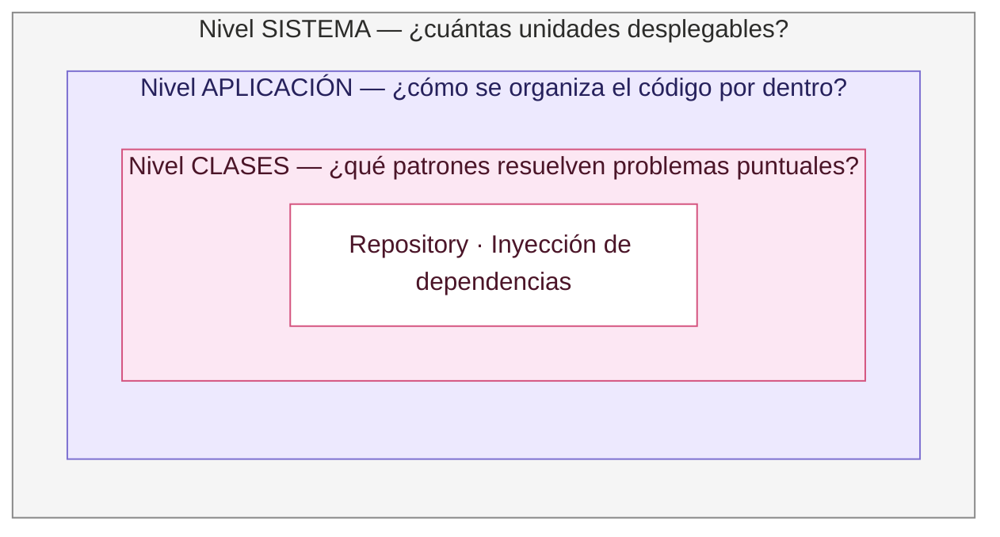
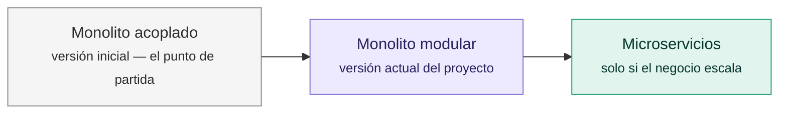
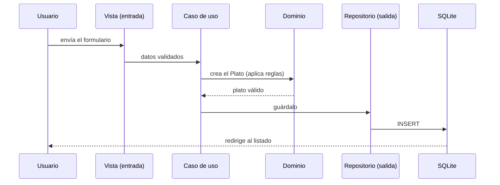
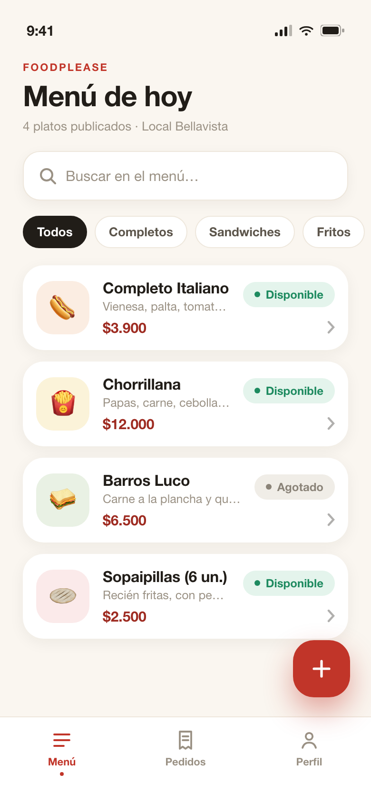
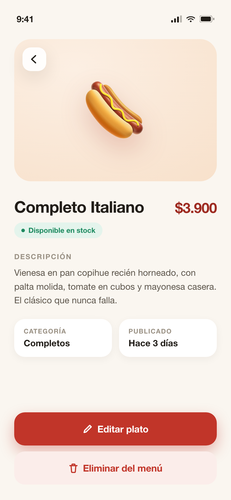
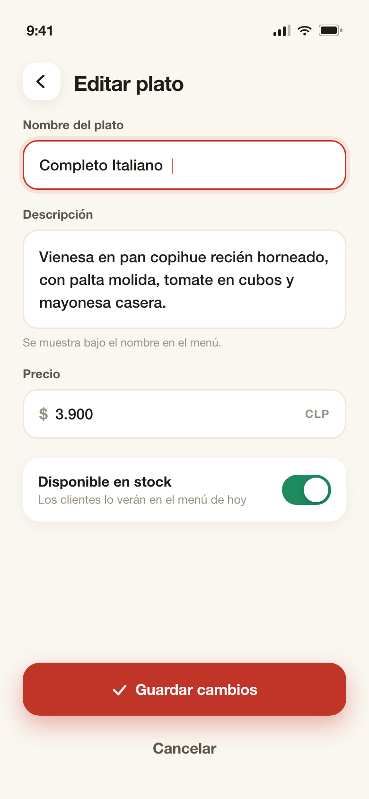
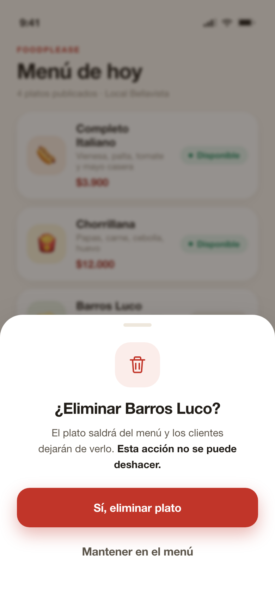
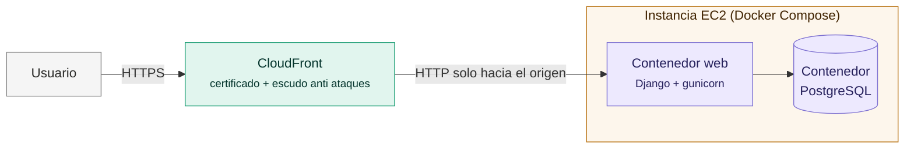
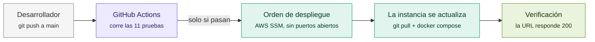

# FoodPlease

> **Universidad Andrés Bello — UNAB Online**
> Curso **APTC106** · Semana 6 · Sumativa 2: Propuesta de Aplicación
> Profesor: **Gonzalo Eduardo Pérez Correa**
> **Grupo 2** — Integrantes: Deizy Rozas Almeida · Kenny Tapia Farfán · Nicolás Sanhueza Díaz · Claudio Figueroa Arias

Aplicación web para administrar el menú de un restaurante o foodservice: permite **listar, agregar, editar y eliminar platos** (un CRUD) desde un panel simple en el navegador.

Está construida con **Django** (Python) y organizada con **arquitectura hexagonal**, una forma de ordenar el código que separa "lo que hace el negocio" de "la tecnología que lo rodea". Este README explica cómo ejecutarla y, sobre todo, **por qué está construida así**.

---

## Cómo ejecutar el proyecto

Solo necesitas tener Python instalado:

```bash
# 1. Crear y activar el entorno virtual (solo la primera vez)
python3 -m venv venv
source venv/bin/activate

# 2. Instalar Django (solo la primera vez)
pip install "Django>=5.2,<5.3"

# 3. Crear la base de datos (solo la primera vez o si cambian los modelos)
python manage.py migrate

# 4. Levantar el servidor
python manage.py runserver
```

Luego abre **http://127.0.0.1:8000** en tu navegador. Para correr las pruebas:

```bash
python manage.py test
```

> **¿Y la base de datos?** No hay que instalar nada: usamos SQLite, que viene incluida en Python. La base de datos es literalmente el archivo `db.sqlite3` que se crea al ejecutar las migraciones.

---

## La idea central: decisiones en tres niveles

Cuando se habla de "arquitectura" se mezclan cosas que en realidad son **decisiones en niveles distintos**. No compiten entre sí: se combinan, como decidir primero si vives en casa o departamento, y después cómo distribuyes las habitaciones por dentro.



Este proyecto toma una decisión explícita en cada nivel:

| Nivel | Pregunta | Nuestra decisión |
|---|---|---|
| **Sistema** | ¿Una aplicación o muchos servicios separados? | Monolito modular |
| **Aplicación** | ¿Cómo ordenamos el código adentro? | Arquitectura hexagonal |
| **Clases** | ¿Qué patrones usamos en el detalle? | Repository, inyección de dependencias |

---

## ¿Por qué un monolito y no microservicios?

Los microservicios sirven cuando hay **muchos equipos** que necesitan trabajar y desplegar sin pisarse, o partes del sistema que necesitan escalar por separado. Ese no es nuestro caso: un equipo, un despliegue, un dominio pequeño.

Partir el proyecto en servicios ahora significaría pagar costos reales (comunicación por red, fallos parciales, varios despliegues que coordinar) **sin recibir ningún beneficio a cambio**. La estrategia elegida se llama *monolith first* (Fowler): empezar con un monolito bien ordenado por dentro, y extraer servicios solo cuando el crecimiento lo exija.



Lo importante: el paso del medio **deja los límites dibujados**. Si mañana hay que extraer un microservicio, la lógica ya está aislada y solo se cambia la forma de conectarla.

---

## ¿Por qué arquitectura hexagonal?

### El problema que había

En la primera versión del proyecto, cada vista de Django hacía **todo a la vez**: recibía la petición web, aplicaba la lógica del negocio y consultaba la base de datos. Eso se llama *acoplamiento*, y sus síntomas son concretos:

- No se podía probar la lógica sin levantar la base de datos.
- No se podía reutilizar la lógica desde otro canal (por ejemplo, una app móvil).
- Cualquier cambio de tecnología arrastraba a toda la aplicación.

### La solución, con una analogía de restaurante

Piensa en el sistema como la cocina de un restaurante:

- El **chef** (la lógica de negocio) sabe preparar los platos y qué reglas se respetan siempre — es el **núcleo**.
- El **garzón** le trae los pedidos. Al chef no le importa si el pedido llegó por mesa, por teléfono o por app: es un **adaptador de entrada**.
- La **bodega** le guarda los ingredientes. Al chef no le importa qué proveedor la llena: es un **adaptador de salida**.

La arquitectura hexagonal hace exactamente eso con el código: el negocio al centro, la tecnología en los bordes, y **contratos claros** (llamados *puertos*) entre ambos.

```mermaid
flowchart LR
    nav["Navegador"]
    subgraph entrada ["Adaptador de ENTRADA"]
        vistas["Vistas Django<br/><small>traducen HTTP</small>"]
    end
    subgraph nucleo ["NÚCLEO — no sabe que Django existe"]
        casos["Casos de uso<br/><small>crear, listar, editar, eliminar</small>"]
        dominio["Dominio<br/><small>entidad Plato + reglas + puerto</small>"]
        casos --> dominio
    end
    subgraph salida ["Adaptador de SALIDA"]
        repo["Repositorio ORM<br/><small>implementa el puerto</small>"]
    end
    bd[("SQLite")]

    nav --> vistas --> casos
    dominio -.->|"puerto (interfaz)"| repo --> bd

    style nucleo fill:#ede9fe,stroke:#7c6fd0,color:#26215c
    style entrada fill:#e1f5ee,stroke:#1d9e75,color:#04342c
    style salida fill:#e1f5ee,stroke:#1d9e75,color:#04342c
    style vistas fill:#ffffff,stroke:#1d9e75,color:#04342c
    style casos fill:#ffffff,stroke:#7c6fd0,color:#26215c
    style dominio fill:#ffffff,stroke:#7c6fd0,color:#26215c
    style repo fill:#ffffff,stroke:#1d9e75,color:#04342c
    style nav fill:#f5f5f5,stroke:#888888,color:#2c2c2a
    style bd fill:#f5f5f5,stroke:#888888,color:#2c2c2a
```



### ¿Qué ganamos? (y qué costó)

- **Se puede probar el negocio sin base de datos**: las pruebas usan un "repositorio de juguete" en memoria.
- **Canales intercambiables**: una API para app móvil sería solo un segundo adaptador de entrada — la lógica no se duplica.
- **Base de datos intercambiable**: pasar de SQLite a PostgreSQL toca un solo archivo.
- **El costo**: más carpetas y más archivos para un CRUD chico. Lo aceptamos porque los beneficios se notan desde ya (en las pruebas) y no solo en el futuro.

---

## Estructura del proyecto

```
foodplease-crud/
├── manage.py                  ← comando para ejecutar todo
├── foodplease_project/        ← configuración general (settings, rutas raíz)
└── menu/                      ← la app: el módulo "menú" del negocio
    │
    ├── domain/                ← EL NÚCLEO (cero Django aquí)
    │   ├── entities.py        ←   el Plato y sus reglas (precio > 0, nombre no vacío)
    │   ├── exceptions.py      ←   errores del negocio
    │   └── ports.py           ←   el "contrato" que la persistencia debe cumplir
    │
    ├── application/           ← LOS CASOS DE USO (las "recetas")
    │   └── use_cases.py       ←   ListarPlatos, CrearPlato, EditarPlato, EliminarPlato
    │
    ├── infrastructure/        ← ADAPTADOR DE SALIDA
    │   └── repositories.py    ←   cumple el contrato usando la base de datos
    │
    ├── presentation/          ← ADAPTADOR DE ENTRADA
    │   ├── views.py           ←   traduce clics y formularios a casos de uso
    │   └── forms.py           ←   valida lo que escribe el usuario
    │
    ├── models.py              ← definición de la tabla (solo la usa infrastructure)
    ├── tests.py               ← 11 pruebas automatizadas
    └── templates/menu/
        ├── base.html          ← esqueleto de todas las páginas
        ├── components/        ← piezas reutilizables (navbar, fila de plato, badge)
        └── pages/             ← páginas armadas con esas piezas
```

### Cómo viaja una petición

Cuando el usuario guarda un plato nuevo, la información recorre este camino:



Si una regla del negocio se rompe (por ejemplo, precio $0), el **dominio** rechaza la operación y el usuario ve el error en el formulario. La regla vive en un solo lugar y se cumple venga de donde venga el dato.

---

## Mockups de la aplicación móvil

En la carpeta [`mockups/`](mockups/) están los diseños de la futura app móvil (pensada para desarrollarse en Flutter): las cuatro vistas principales con sus primeras interacciones de navegación, sin lógica todavía. Cada pantalla existe como HTML/CSS (el código fuente del diseño) y como imagen renderizada.

| Menú | Detalle | Formulario | Eliminar |
|---|---|---|---|
|  |  |  |  |

La app móvil consumirá una API REST que se agregará como segundo adaptador de entrada — misma lógica de negocio, cero duplicación (ver "¿Y el futuro?" más abajo).

---

## El frontend también tiene arquitectura

Las plantillas HTML siguen la misma idea de separación, inspirada en *Atomic Design*:

- **`components/`** — piezas chicas y reutilizables, cada una con una sola responsabilidad: la barra de navegación, una fila de la tabla, el badge de "Disponible/Agotado".
- **`pages/`** — las páginas completas, que se arman **componiendo** esas piezas.

Así el HTML no se repite, y si el día de mañana el frontend se convierte en una aplicación React o Vue, esta división de componentes y páginas se traslada casi igual.

---

## Las pruebas: la evidencia de que el diseño funciona

El proyecto tiene **11 pruebas automatizadas** (`python manage.py test`) en dos niveles:

1. **Pruebas del negocio en aislamiento** — usan un repositorio en memoria (sin base de datos, sin servidor web). Verifican que se crea, edita y elimina correctamente y que las reglas se cumplen. *Esto era imposible en la versión original*, porque la lógica estaba pegada a la vista y a la base de datos.
2. **Pruebas del flujo completo** — simulan al usuario real: envían formularios y verifican redirecciones, errores visibles y el 404 cuando el plato no existe.

---

## ¿Y el futuro?

La arquitectura deja el camino pavimentado. Cada necesidad nueva tiene un lugar claro donde conectarse:

| Si mañana necesitamos... | Lo único que cambia |
|---|---|
| Una app móvil | Se agrega una API REST como segundo adaptador de entrada (misma lógica, cero duplicación) |
| Una base de datos "de verdad" (PostgreSQL) | El adaptador de salida y la configuración |
| Nuevos módulos (pedidos, usuarios) | Nuevas apps con sus propias capas, mismo patrón |
| Escalar en serio (equipos, tráfico) | Se extraen módulos como microservicios: los límites ya existen |

---

## Entregas del curso

### Sumativa 2 — Semana 6: Propuesta de Aplicación

Primera entrega del proyecto: el CRUD web funcional con despliegue local, refactorizado desde la versión inicial acoplada hacia el monolito modular con arquitectura hexagonal que documenta este README, con sus 11 pruebas automatizadas y las decisiones de diseño argumentadas. Informe: `aptc106_s6grupo2.docx`.

### Sumativa 3 — Semana 9: Propuesta y Visualización al Repositorio

Segunda entrega (este repositorio es parte de ella):

- **Repositorio público en GitHub** con el historial completo del proyecto.
- **Mockups de la aplicación móvil** (carpeta [`mockups/`](mockups/)) con sus interacciones de navegación.
- **Propuesta de integración móvil/web**: app Flutter que consumirá una API REST (Django REST Framework) agregada como segundo adaptador de entrada al núcleo hexagonal.
- **Despliegue real en la nube** y **pipeline CI/CD**, detallados a continuación.

#### La arquitectura en la nube

La aplicación está desplegada en AWS y accesible en **https://dkru8u5k5ghu5.cloudfront.net**. Así fluye una visita:



Decisiones de seguridad del despliegue:

- **CloudFront al frente**: aporta el certificado HTTPS (candado en el navegador) y absorbe ataques antes de que lleguen al servidor.
- **La base de datos no es accesible desde internet**: vive solo en la red interna de Docker.
- **SSH restringido**: únicamente direcciones autorizadas pueden administrar el servidor.
- **Configuración por variables de entorno**: los secretos (claves, contraseñas) se generan en el servidor y nunca se suben al repositorio (aprovisionamiento en [`deploy/ec2-user-data.sh`](deploy/ec2-user-data.sh)).
- Para desarrollar sin gastar, el `docker-compose.yml` local incluye **LocalStack**: un AWS emulado que corre en tu máquina.

#### Integración y despliegue continuo (CI/CD)

Cada `git push` a `main` publica automáticamente — pero solo si las pruebas pasan:



Dos detalles de diseño que vale la pena conocer:

- **GitHub no guarda ninguna credencial de AWS**: se autentica con identidad federada (OIDC) y la confianza está anclada al ID inmutable de este repositorio, rama `main` únicamente. El workflow está en [`.github/workflows/deploy.yml`](.github/workflows/deploy.yml) y la configuración de AWS en [`deploy/setup-cicd.sh`](deploy/setup-cicd.sh).
- **El despliegue viaja por AWS SSM**, no por SSH: la orden llega a la instancia a través de la propia AWS, sin abrir puertos adicionales.

Informe: `aptc106_s9grupo2.docx`.
